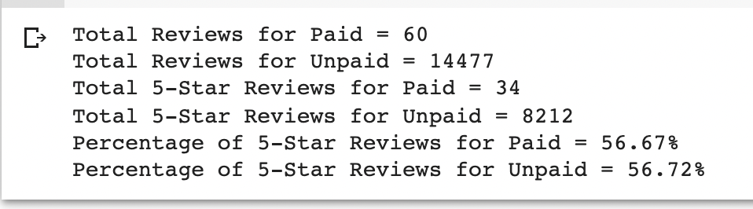

# Amazon_Vine_Analysis

## Overview of the analysis: 
I was asked to analyze Amazon reviews written by members of the paid Amazon Vine program. The Amazon Vine program is a service that allows manufacturers and publishers to receive reviews for their products. Companies pay a small fee to Amazon and provide products to Amazon Vine members, who are then required to publish a review.

In this project, the dataset I worked with was reviews of musical instruments. I used PySpark to perform the ETL process and to determine if there is any bias toward favorable reviews from Vine members. 

## Results: 

- There were 60 Vine reviews and 14,477 non-Vine reviews.
- 34 Vine reviews were 5 stars. 8212 non-Vine reviews were 5 stars.
- 56.67% of Vine reviews were 5 stars. 56.72% of non-Vine reviews were 5 stars.

## Summary: 
In my dataset of musical instruments, I did not see any positivity bias for reviews in the Vine program. There was only a .05% difference in favor of the non-Vine reviews being more positive so practicaly dead even.  One additional step I could take in this analysis would be to remove the non-verified purchases from the dataset and recalcualte the reviews.